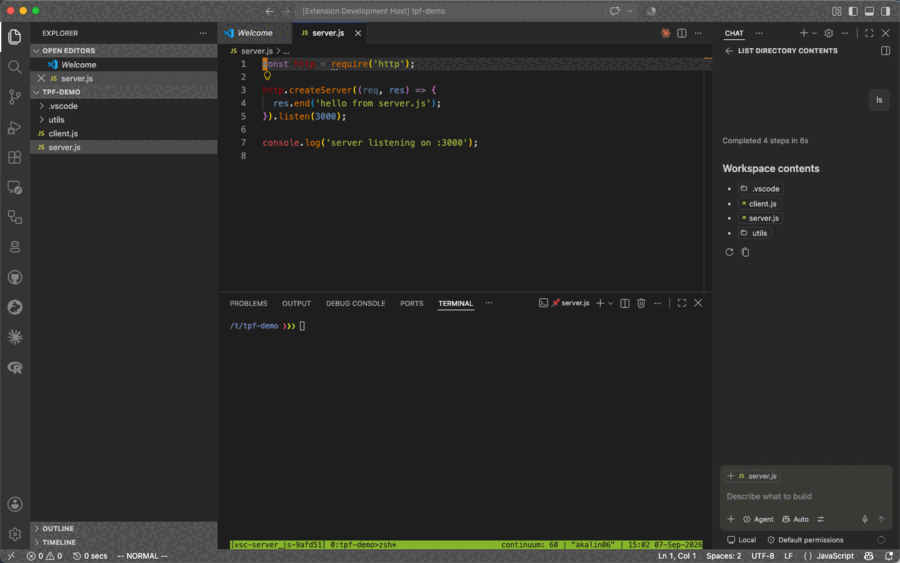
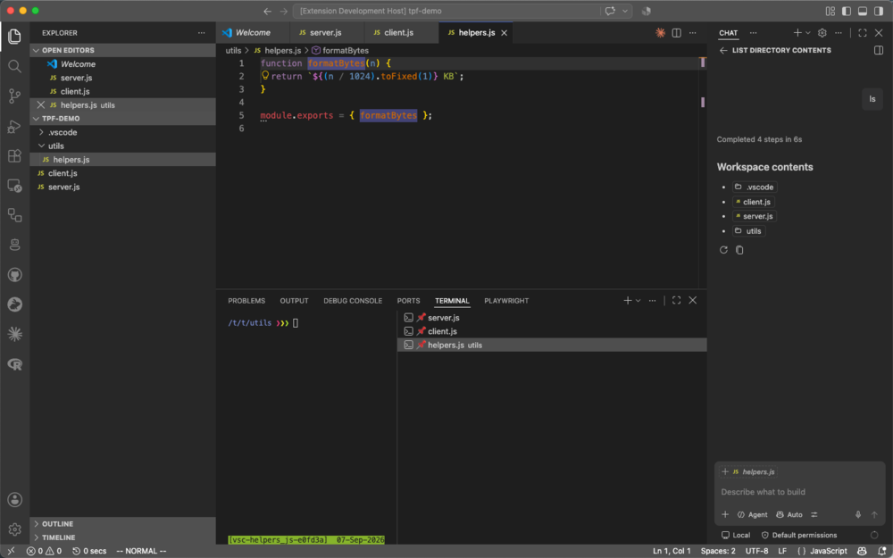
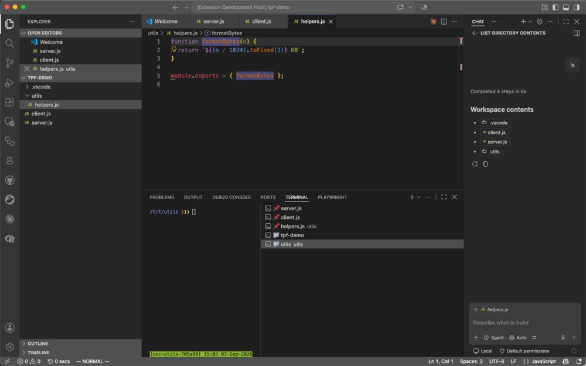

<p align="center">
  
</p>

<h1 align="center">Terminal Per File</h1>

<p align="center">
  Pin a dedicated terminal to each file (or directory) and auto-switch to it as you move between editors.
</p>

<p align="center">
  
</p>

## Why

Working across several files that each have their own long-running process (a
dev server, a watcher, a REPL, an SSH session) usually means either juggling
one shared terminal or manually renaming/finding the right tab every time you
switch files. **Terminal Per File** removes that friction: every file (or
directory) gets its own terminal, and it's shown automatically whenever that
file becomes the active editor.

## Features

- **Auto-switching terminals** — when you switch the active editor, its
  pinned terminal is shown (creating it on first use), without stealing
  keyboard focus from the editor.
- **File or directory scope** — pin one terminal per file, or share one
  terminal across every file in the same directory.
- **Optional tmux backing** — back each pinned terminal with a persistent
  tmux session so long-running processes survive closing VS Code and
  reattach automatically next time.
- **Commands** to pause auto-switching temporarily or close the terminal
  pinned to the current file.
- **Per-extension filtering and startup commands** — only pin terminals for
  specific file types, and optionally run a command (e.g. launch a REPL) the
  first time a terminal is created for one.
- **Status bar indicator** showing whether auto-switch is currently on or
  paused — click it to toggle, same as the command.

For example, to only pin terminals for R scripts and R Markdown files, and
drop straight into an R console for each one:

```json
{
  "terminalPerFile.includeExtensions": ["R", "Rmd"],
  "terminalPerFile.startupCommands": { "R": "R", "Rmd": "R" }
}
```

For regex-based matching (ignore files by pattern, or pick a startup command
based on more than just the extension), see
[docs/advanced-matching.md](docs/advanced-matching.md).

### File scope vs. directory scope

<table>
<tr><th><code>terminalPerFile.scope: "file"</code></th><th><code>terminalPerFile.scope: "directory"</code></th></tr>
<tr>
<td></td>
<td></td>
</tr>
<tr>
<td>Every file gets its own terminal — <code>server.js</code>, <code>client.js</code> and <code>helpers.js</code> each pinned separately.</td>
<td>Files in the same folder share one terminal — <code>server.js</code> and <code>client.js</code> (both in <code>tpf-demo/</code>) share the <code>tpf-demo</code> terminal, while <code>helpers.js</code> (in <code>tpf-demo/utils/</code>) gets its own <code>utils</code> terminal.</td>
</tr>
</table>

## Requirements

- VS Code `^1.80.0`.
- [tmux](https://github.com/tmux/tmux) installed and on your `PATH` — only if
  you enable `terminalPerFile.useTmux`.

## Extension Settings

| Setting | Type | Default | Description |
|---|---|---|---|
| `terminalPerFile.scope` | `"file" \| "directory"` | `"file"` | Pin one terminal per file, or one terminal shared by every file in the same directory. |
| `terminalPerFile.useTmux` | `boolean` | `false` | Back each pinned terminal with a persistent tmux session instead of a plain VS Code terminal. |
| `terminalPerFile.tmuxSessionPrefix` | `string` | `"vsc-"` | Prefix used when naming the tmux session for each file/directory (only used when `useTmux` is enabled). |
| `terminalPerFile.tmuxBinary` | `string` | `"tmux"` | Path to the tmux executable, if it's not on your `PATH`. |
| `terminalPerFile.includeExtensions` | `string[]` | `[]` | File extensions (without the dot) to pin terminals for, e.g. `["R", "Rmd"]`. Empty means every file (default); non-matching files are left alone entirely. |
| `terminalPerFile.startupCommands` | `object` | `{}` | Map of file extension (without the dot) to a shell command to run the first time a terminal is created for that file type, e.g. `{ "R": "R", "Rmd": "R" }` to drop into an R console. |
| `terminalPerFile.ignorePattern` | `string` | `""` | Advanced. Regex tested against the full file path; matches are left alone entirely. See [docs/advanced-matching.md](docs/advanced-matching.md). |
| `terminalPerFile.startupCommandRules` | `{pattern, command}[]` | `[]` | Advanced. Ordered regex-to-command rules, checked before `startupCommands`. See [docs/advanced-matching.md](docs/advanced-matching.md). |

## Commands

| Command | Description |
|---|---|
| `Terminal Per File: Toggle Auto-Switch` | Pause or resume automatically showing the pinned terminal when you switch editors. |
| `Terminal Per File: Close Terminal For Current File` | Dispose the terminal pinned to the current file (or directory, in directory scope). |

A status bar item on the right shows the current auto-switch state -
`$(pinned) Terminal Per File` when on, `$(pin) Terminal Per File (paused)`
(highlighted) when paused - and toggles it when clicked.

> With `useTmux` enabled, closing the terminal only detaches the tmux client —
> the session (and anything running in it) keeps going in the background and
> reattaches automatically next time you open that file. Run
> `tmux kill-session` yourself if you want to actually end it.

## Installation

This extension isn't published to the Marketplace. Install it from source:

```bash
git clone https://github.com/alexg9010/vscode-terminal-per-file.git
cd vscode-terminal-per-file
npx @vscode/vsce package
code --install-extension terminal-per-file-0.0.1.vsix
```

## Development

1. Open this folder in VS Code.
2. Press `F5` (or run "Run Extension" from the Run and Debug view) to launch
   an Extension Development Host with the extension loaded.
3. Open a couple of files in the dev host window and switch between them to
   see terminals get pinned and shown automatically.

No build step or dependencies are required — `extension.js` is plain
CommonJS, loaded directly by VS Code.

## Known limitations

- Auto-switching only triggers on file-scheme documents (untitled/diff/output
  editors are ignored).
- Closing a terminal manually (e.g. clicking the trash icon) unpins it; the
  next visit to that file creates a fresh one.

## License

[MIT](LICENSE)
